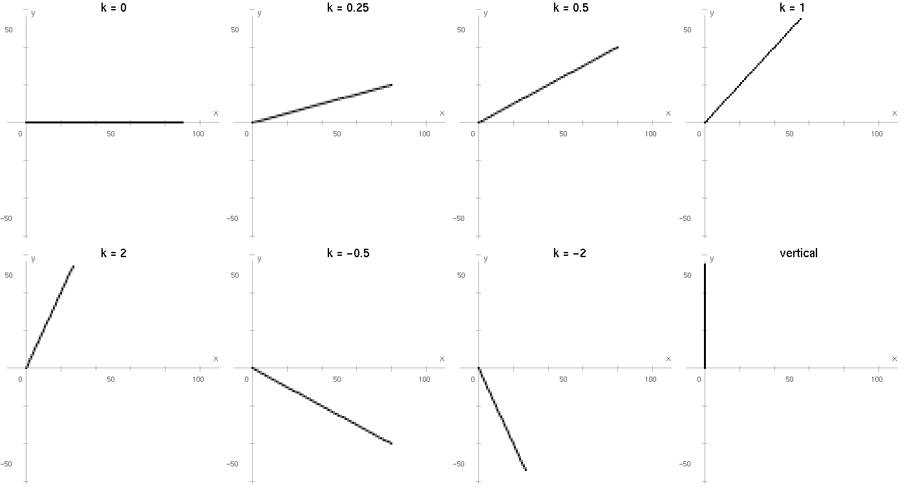

# 不同斜率下的 Wu 反走样结果分析

以原点 $(0,0)$ 为起点，分别绘制斜率为 $k=0$、$0.25$、$0.5$、$1$、$2$、$-0.5$、$-2$ 的直线以及垂直直线，得到如下图像：

观察这些直线后，我从主位移方向、相邻像素的位置和相邻像素的灰度变化三个方面进行了比较：

## 1. 主位移方向

通过对比图中较平缓和较陡的直线，我发现主位移方向与斜率的绝对值有关。

$|k|\leq1$ 的直线在水平方向延伸得更快，算法沿 $x$ 方向逐步绘制；$|k|>1$ 的直线在竖直方向延伸得更快，算法改为沿 $y$ 方向逐步绘制。

垂直直线也按 $y$ 方向处理，因此不需要计算无穷大的斜率。

这一点在 $k=0.5$ 和 $k=2$ 两条直线上表现得比较明显：

$k=0.5$ 的直线较平缓，绘制时每次沿 $x$ 方向移动一个单位；$k=2$ 的直线较陡，绘制时每次沿 $y$ 方向移动一个单位。

两条直线的 $x$、$y$ 作用正好交换，进一步说明了主位移方向由斜率的绝对值决定。

## 2. 相邻像素的位置

继续观察直线附近的像素分布，我发现两个候选像素的排列方向总是与主位移方向垂直。

算法沿 $x$ 方向前进时，理想直线通常落在同一列的两个像素之间，因此选取上下相邻的像素；算法沿 $y$ 方向前进时，理想直线通常落在同一行的两个像素之间，因此选取左右相邻的像素。

对比 $k=0.5$ 和 $k=2$ 可以更直观地看到这种差别。绘制 $k=0.5$ 的直线时，每进入下一列，就选取上下两个像素；绘制 $k=2$ 的直线时，每进入下一行，就选取左右两个像素。

我还比较了 $k=0.5$ 和 $k=-0.5$。两条直线都以 $x$ 为主位移方向，也都选取上下相邻的像素；不同之处在于一条向右上方延伸，另一条向右下方延伸。因此，斜率的正负只改变直线的延伸方向，不改变相邻像素的排列方式。

## 3. 相邻像素的灰度变化规律

从图中的深浅变化可以看出，Wu 算法并不是只选取距离理想直线最近的一个像素，而是把直线颜色分配给两个相邻像素。

两个像素的覆盖率之和始终为 1，理想直线越靠近某个像素中心，该像素的覆盖率越大，颜色越深；距离越远，覆盖率越小，颜色越接近白色背景。颜色在两个像素之间逐渐转移，使直线边缘的变化更加平滑。

当 $k=0.25$ 时，两个像素的覆盖率按照

$$
1/0\rightarrow0.75/0.25\rightarrow0.5/0.5\rightarrow0.25/0.75\rightarrow1/0
$$

循环，经过 4 个主位移步完成一次转移。

当 $k=0.5$ 时，覆盖率按照

$$
1/0\rightarrow0.5/0.5\rightarrow1/0
$$

循环，经过 2 个主位移步完成一次转移。

通过对比这两条直线，我发现，在主位移方向相同的情况下，斜率绝对值越大，非主位移方向的坐标变化越快，灰度转移周期也越短。

再对比 $k=0.5$ 与 $k=2$，可以发现两者的覆盖率变化节奏相同，只是 $k=0.5$ 在上下像素之间进行灰度转移，而 $k=2$ 在左右像素之间进行灰度转移。

观察负斜率直线也能看到相同的规律，说明斜率符号改变的是直线的延伸方向，不会改变对应的灰度变化周期。

最后观察水平线、$k=1$ 的对角线和垂直直线，可以看到它们都经过整数像素中心。此时主要像素的覆盖率为 1，另一个像素的覆盖率为 0，因此图中几乎没有明显的灰度扩散。
